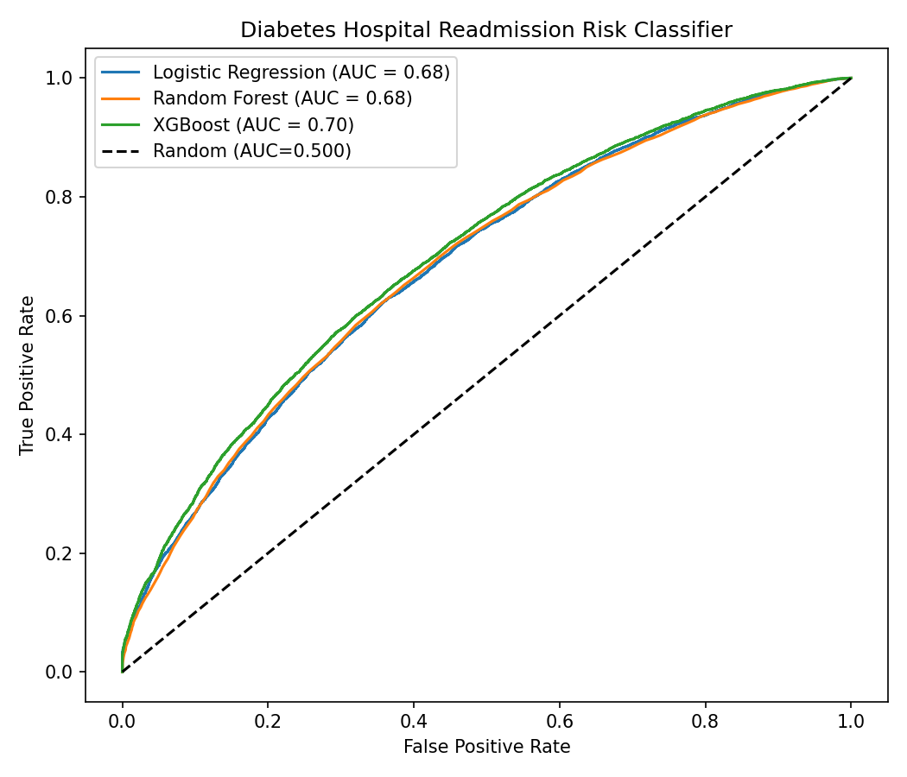
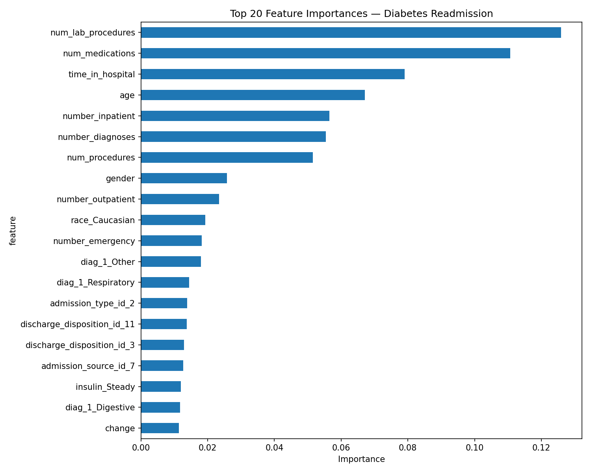

# Diabetes Hospital Readmission Risk Classifier

A machine learning pipeline that predicts hospital readmission risk for diabetic patients using clinical and demographic data from 130 US hospitals. Three classification models are trained and compared, with feature importance analysis to identify the key drivers of readmission risk.

**Best Result:** XGBoost AUC **0.70**

---

## Problem Statement

Hospital readmission is a significant clinical and economic burden. Predicting which patients are at risk of readmission allows hospitals to intervene early — improving patient outcomes and reducing costs. This project builds a binary classifier to predict whether a diabetic patient will be readmitted following discharge, using structured electronic health record (EHR) data.

---

## Dataset

**Source:** [UCI Machine Learning Repository — Diabetes 130-US Hospitals (1999–2008)](https://archive.ics.uci.edu/dataset/296/diabetes+130-us+hospitals+for+years+1999-2008)

- 101,766 inpatient encounters across 130 US hospitals
- 47 features covering patient demographics, hospital stay details, lab results, diagnoses, and diabetes medications
- Associated publication: Strack et al. (2014), *BioMed Research International*

**Target variable:** Any hospital readmission vs. no readmission (binary)

**Class distribution after preprocessing:**
- Not readmitted: 53%
- Readmitted: 47%

---

## Requirements

```bash
conda install pandas numpy scikit-learn matplotlib
conda install xgboost
```

---

## Data Preprocessing

The raw dataset required significant cleaning before modeling. Key decisions:

**Columns dropped due to many missing values:**
- `weight` (97% missing)
- `max_glu_serum` (95% missing)
- `A1Cresult` (83% missing)
- `payer_code` (40% missing)
- `medical_specialty` (49% missing)

Note: `A1Cresult` was the primary focus of the original Strack et al. publication, but was largely absent in the UCI version of the dataset, limiting direct comparison to the paper's findings.

**Feature engineering:**
- `age` — ordinal bins ([0-10), [10-20)...) encoded as midpoint numeric values (5, 15, 25...)
- `diag_1` — ICD-9 primary diagnosis codes grouped into 8 clinical categories (Circulatory, Respiratory, Digestive, Diabetes, Injury, Musculoskeletal, Genitourinary, Neoplasms, Other)
- `diag_2` and `diag_3` — dropped; primary diagnosis was only diagnosis used
- `gender`, `change`, `diabetesMed` — binary encoded
- 23 diabetes medication columns — one-hot encoded (No/Steady/Up/Down)
- Remaining categorical columns — one-hot encoded

**Rows dropped:**
- 3 rows with `Unknown/Invalid` gender
- Rows with missing `race` (~2%)

**Final dataset:** 99,493 rows × 120 features

---

## Running the Pipeline

### Step 1 — Clean the data
```bash
python diab_dataset_cleaner.py
```
Outputs: `diabetes_cleaned.csv`

### Step 2 — Train and evaluate models
```bash
python diab_outcome_model.py
```
Outputs: `roc_curve_diab.png`

### Step 3 — Feature importance
```bash
python rf_feature_importance.py
```
Outputs: `feature_importance.png`

---

## Results

| Model | AUC |
|---|---|
| Logistic Regression | 0.68 |
| Random Forest | 0.68 |
| XGBoost | 0.70 |



All three models meaningfully outperform random chance (AUC 0.50), however XGBoost performs best. The similarity in performance across models suggests the limiting factor is the available features rather than the choice of algorithm — the administrative EHR data alone does not fully capture what drives readmission risk.

---

## Feature Importance



The top predictors identified by Random Forest are clinically interpretable:

- **num_lab_procedures** and **num_medications** — indicative of disease severity and complexity
- **time_in_hospital** — longer stays indicate more severe illness
- **age** — older patients have higher readmission risk
- **number_inpatient** — prior hospitalizations are a strong predictor of future ones
- **number_diagnoses** — greater burden increases readmission risk
- **discharge_disposition_id_11** — discharge to hospice, a clinically meaningful risk indicator

Notably, disease severity and complexity features dominate over demographic features, suggesting the model is learning clinical patterns rather than demographic proxies.

---

## Methods Notes

**Target variable:** Readmission was framed as binary — any readmission (within or beyond 30 days) vs. no readmission. Early analysis with <30 day readmission as the target produced a severely imbalanced dataset (class distribution = 89%/11%) and poor minority class recall, even with balancing class weights in the model. Reframing to any readmission vs. none produced a near-balanced dataset (class distribution = 53%/47%) and substantially improved model performance.

---

## Data Source

Clore, J., Cios, K., DeShazo, J., & Strack, B. (2014). Diabetes 130-US Hospitals for Years 1999-2008 [Dataset]. UCI Machine Learning Repository. https://doi.org/10.24432/C5230J
